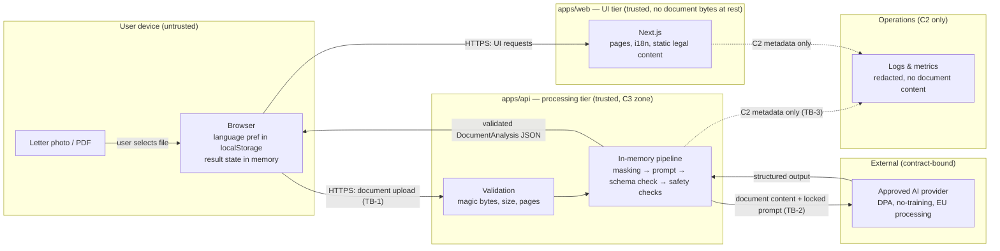

# Trust Boundaries and Data Flow — Welcome Germany

> Stage 1 deliverable. Updated whenever a component or flow is added. The diagram below is the reference for every security and privacy discussion.

## Data-flow diagram (target MVP architecture)

## Trust boundaries

### TB-0: User device ↔ everything

The browser is untrusted input territory. Everything arriving from it (files, form fields, headers) is validated server-side. Everything sent to it is data, not code: analysis results render as text, never as HTML.

### TB-1: Browser ↔ apps/api (the upload boundary)

- Only `apps/api` ever receives document bytes. `apps/web` never proxies or stores them.
- Controls at this boundary (Stage 3): TLS only, CORS deny-by-default (web origin only), content-type + magic-byte validation, size/page/pixel limits, rate limiting, request timeouts, random request IDs.
- Nothing crossing inward persists: memory-only processing, cleanup on every exit path.

### TB-2: apps/api ↔ AI provider (the confidentiality boundary)

- Crossed only by: the locked, versioned analysis prompt + prepared document content; nothing else (no user identifiers, no filenames, no IPs).
- Only an approved provider (completed §9 checklist) may sit behind this boundary. Provider responses are untrusted until schema-validated and safety-checked.
- **The document is data on both sides:** instructions inside the document must not alter system behavior (prompt-injection rule, master-spec §10) — enforced in prompt design and tested by injection fixtures.

### TB-3: Processing ↔ observability (the leakage boundary)

- Only C2 fields (data-classification.md) may cross into logs/metrics/error reports. Redaction is configured centrally (`apps/api/src/server.ts` REDACT_PATHS) and extended with every new route.
- Automated tests assert C3 content cannot cross (Stage 3 onward).

### TB-4: Developer/CI ↔ production (the supply-chain boundary)

- Protected `main`, PR checks, frozen lockfiles now; secret scanning, SAST, container scanning, SBOM in Stage 6; deploy approval gates in Stage 7.
- No real user documents in any development or test environment, ever.

## Explicitly forbidden flows

- Browser → AI provider directly (credentials would leak; provider sees user IP).
- Document bytes → `apps/web`, logs, error reports, database (none exists — ADR 0006), disk (unless a documented Stage 3 exception with cleanup proof).
- AI output → browser without schema validation.
- Document-derived text → any third party other than the approved provider.
